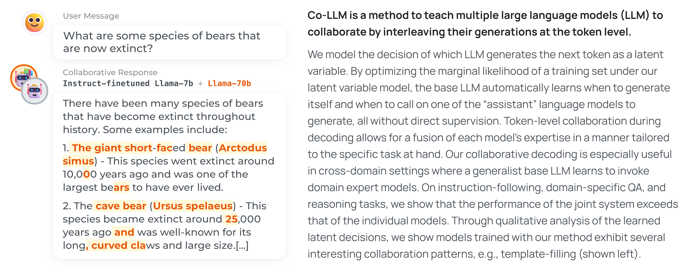
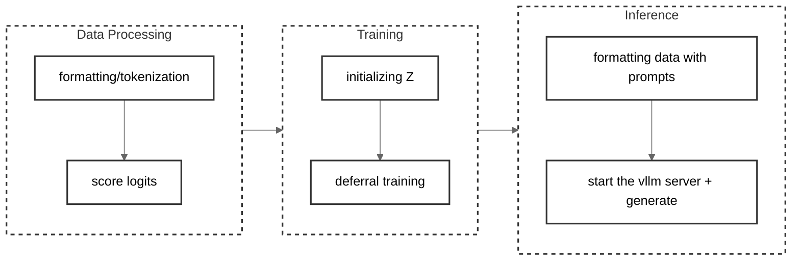

# Co-LLM: Learning to Decode Collaboratively with Multiple Language Models

[🎉 Check our paper!](https://arxiv.org/abs/2403.03870)


## Overview



## Demo 

<video src="https://github.com/clinicalml/co-llm/assets/22512825/16f287b6-b363-4c2b-b886-25028b755fb9"></video>

## Usage 

Use the following code to create the environment:

```bash
conda create -n co-llm python=3.11 -y
conda activate co-llm
conda install \
    pytorch==2.1.0 torchvision==0.16.0 torchaudio==2.1.0 \
    pytorch-cuda=12.1 -c pytorch -c nvidia -y

pip install -r requirements.txt
```

### Overview 

The diagram below shows all the steps needed to reproduce our results. Please check the bash scripts in the `scripts` folder for a quick start for running the code. For detailed instructions, please refer to the following sections: 

[Data Processing](#data-processing) | [Training](#training) | [Inference](#inference)



### Data Processing  

For example, for `gsm8k`: 

```bash
## Step1: Format the dataset 
python scripts/train/gsm8k/create_train_data.py

## Step2: Create the training data for deferral training: 
bash scripts/train/gsm8k/process_dataset.sh

## Step3: Create the initialization dataset: 
bash scripts/train/gsm8k/create_init_dataset.sh
```

It will process the raw dataset (reformatting with the proper templates) and save it to `data/processed/gsm8k/gsm8k_data.jsonl`; 
then it will use the corresponding models to score the dataset and save it in `checkpoints/dataset/gsm8k-completion/<model-name>`.
Finally it will generate the initialization dataset in `checkpoints/dataset/gsm8k-completion/init-a-Llama-2-7b-hf+EleutherAI@llemma_7b`. 

### Training 

```bash
bash scripts/train/gsm8k/deferral_finetune_with_hf_trainer.sh
```

It firstly use the weak supervision labels to initialize the $Z$ vector, then uses the deferral training to fine-tune the model.
The checkpoints will be saved in `checkpoints/deferral_finetuned/gsm8k-completion_Llama-2-70b-hf/Llama-2-7b-hf~128bz` -- indicating it is training a `Llama-2-7b` model to collaborate with `Llama-2-70b-hf` as the assistant model.

We assume you have a folder called `weights/` with all the models downloaded, for example: 
```bash
weights
├── EleutherAI@llemma_34b
├── EleutherAI@llemma_7b
├── epfl-llm@meditron-70b
├── epfl-llm@meditron-7b
├── Llama-2-13b-hf
├── Llama-2-70b-hf
└── Llama-2-7b-hf
```

If you want to train models with other collaboration pairs, you can adjust the following arguments in the [bash script](scripts/train/gsm8k/deferral_finetune_with_hf_trainer.sh): 
```bash
DATASET_NAME="gsm8k-completion/Llama-2-70b-hf"                               # <--- The static dataset for the assistant model 
DEFERRAL_INIT_DATASET="gsm8k-completion/init-a-Llama-2-7b-hf+Llama-2-70b-hf" # <--- The initialization dataset 
    # You might need to modify scripts/train/gsm8k/create_init_dataset.sh to create the initialization data 
MODEL_NAME="Llama-2-7b-hf"                                                   # <--- The base model being trained
```

#### Baseline training code

We also provide the scripts training other baseline models:  

| Baseline Name                  | Script                                                                           |
| ------------------------------ | -------------------------------------------------------------------------------- |
| Default supervised fine-tuning | `bash scripts/train/gsm8k/default_finetune_with_hf_trainer.sh`                   |
| QLoRA training                 | `bash scripts/train/gsm8k/finetune_qlora_with_accelerate.sh`                     |
| Weak supervision baseline      | `bash scripts/train/gsm8k/deferral_finetune_with_hf_trainer_weak-supervision.sh` |


### Inference 

Since we need to orchestrate multiple models during inference time, we use `vllm` to separate services for a model, and then we use these service in an API-like manner to generate the results. 

There are three different `vllm` service: 
| Service | Script |
| ------- | ------ |
| `collm/inference/api_server_simple.py`  | It's the regular LLM API Server. |
| `collm/inference/api_server_deferral.py`  | It separates the last vocab position prediction (deferral token) from the rest when calculating the token logprobs; it returns the raw logits so one can then apply a sigmoid function to obtain the deferral probability. |
| `collm/inference/api_server_logits.py`  | Different from the regular server, it returns the un-normalized token logits from the model, which will be used in baseline models like Proxy Tunning or Contrastive Decoding. *However it is a bit tricky to use this code as you might need to manually modify the installed `vllm` code to ensure it returns the logits. A update on `vllm` will make this much easier.*  | 

Here is an example of how to use the scripts for deferral generation: 
```bash
bash scripts/evaluation/gsm8k/deferral_generate.sh
```
It uses the `scripts/evaluation/generic/deferral_generate.sh` script with three steps: 
1. Run the deferral search to generate on a small validation set under different deferral frequency
2. Evaluate the accuracy and pick the best deferral threshold 
3. Run Co-LLM generation with the optimal threshold. 

We also need to run the `forward.js` script to start a javascript-based batch request forwarding server: `node forward.js`. 
It will be terribly slow to batch send async requests to the `vllm` server in Python (during the threshold searching stage); so we made this javascript based forwarding server to speed up this process. 
The dependency is very minimal -- you only need to install `express` and `axios` with `npm install express axios`.

## Acknowledgement 

Our code is extensively inspired by [allenai/open-instruct](https://github.com/allenai/open-instruct); we reused many code from the their library in our codebase.

## Citation

If you find our work helpful, please cite it as: 

```bibtex
@article{shen2024learning,
  title={Learning to Decode Collaboratively with Multiple Language Models},
  author={Shen, Shannon Zejiang and Lang, Hunter and Wang, Bailin and Kim, Yoon and Sontag, David},
  journal={arXiv preprint arXiv:2403.03870},
  year={2024}
}
```
